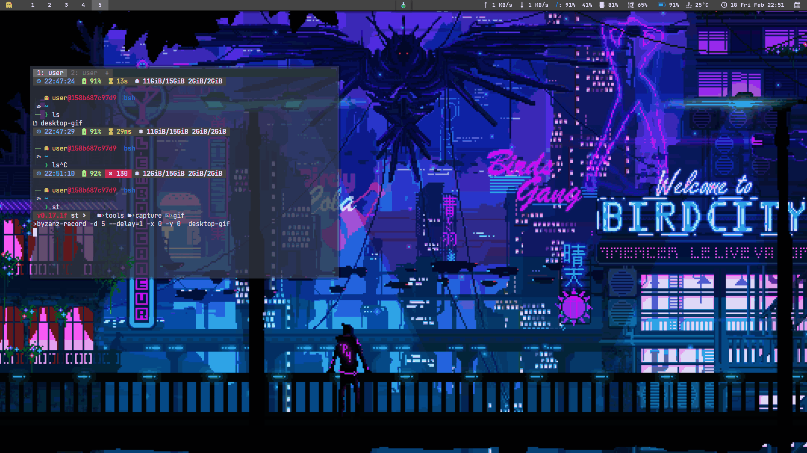

<h1 align="center">Hello👋, I'm Pujan Sarkar</h1>
<h3 align="center">Frontend Developer | Backend Enthusiast | Open Source Contributor | Cybersecurity Enthusiast | CTF Player 🚩</h3>

# 💫 About Me:
- 🚀 Enthusiastic Computer Science student, passionate about web development and cybersecurity.
- 🌱 Currently building real-world applications and contributing to open-source projects.
- 🌱 I’m currently learning - Node.js, Advanced Backend Development, and Real-Time Applications.
- 💡 Ask me about - Web Development, JavaScript, and Cybersecurity.

# 🔥 Projects:
- **[Pathway](https://pathwayabout.vercel.app/)** - A real-time chat web application built with React, Node.js, MongoDB, and Socket.IO.
- **[Fix-Up](https://github.com/RIO-Repository/Fix-Up)** - Service appointment booking platform (MERN stack) for electricians, carpenters, and more.
- **[Care](https://care-nine.vercel.app/)** - Employment and e-waste marketplace leveraging geolocation and real-time data (Docker, Express.js, Tailwind CSS).
- **[FarmLoc](https://drive.google.com/file/d/1-QRuvi1qCbZgSoyblV7GTM2cidCNcSK4/view?usp=drivesdk)** - Agricultural app for locating cold storage and boosting farmer incomes.

# 📚 Education:
**Bachelor of Engineering in CSE** - University Institute of Technology, The University of Burdwan (2022 - 2026)

# ⚡ Experience:
- **Girlscript Summer of Code 2024**: Contributor & Project Mentor (Present)
- **Hacktoberfest 2024**: Contributor
- **Social Summer of Code Season 3**: Contributor

## 🌐 Connect with Me:

# 💻 Tech Stack:

# 📊 GitHub Stats:
 
 

### 🔝 Top Contributed Repo

## 🏆 GSSOC Badges:

